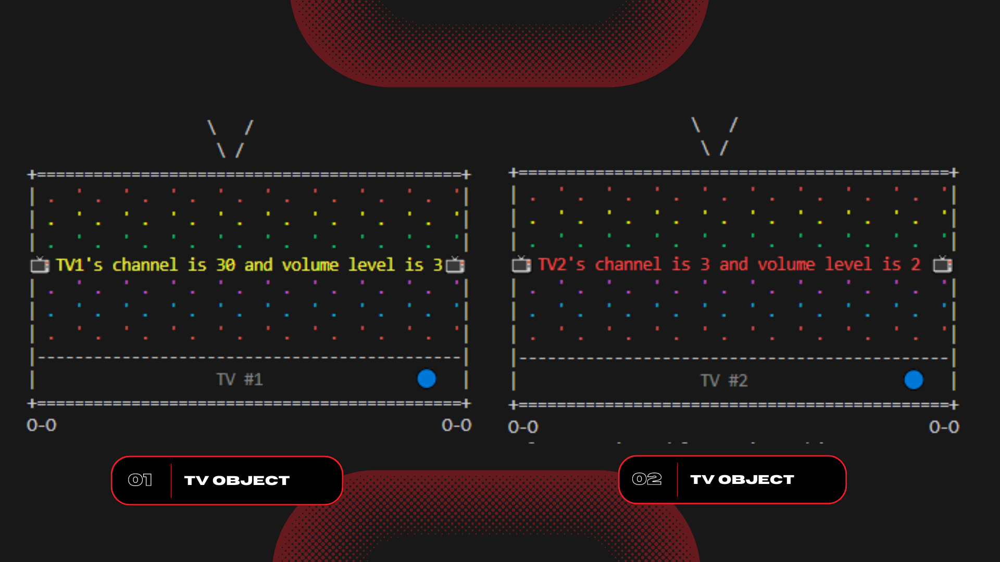

# Simple TV Functionality
This program defines a class named TV that simulates the basic functionality of a TV set, such as turning on and off, changing channels, and adjusting volume. It also defines a function named TestTV that creates two TV objects and tests their methods. The output of the function includes an ASCII art representation of the TV screen, along with the current channel and volume level.

**See sample output:** <br>


## 📄 Documentation 
<details><summary><h3> 💡 Purpose </h3></summary>

-----

The objective of this program is to demonstrate the basic concepts of object-oriented programming in Python. Using the TV class to encapsulate the TV's state and behavior, we can create multiple TV objects and control their state independently.
</details>

<details><summary><h3> 🤔 Usage </h3></summary>

-----

1. To use this program, simply run the TestTV() function in a Python environment. This will create two TV objects, set their state (channel and volume), and display their state as ASCII art in the terminal.

or

1. Fork this repository 
2. Once the repository has been forked, you can clone the repository to your local machine using the `git clone` command followed by the repository URL.
3. Once the repository is cloned, navigate to the directory of the cloned repository using the `cd` command.
4. Now you can work with the files in the cloned repository.
5. If you want to keep your fork in sync with this repository, you can use the `git fetch` and `git merge` commands to pull in changes and merge them into your local copy.

**Reminders:**
> This is a simple implementation of a TV remote control, and it can be extended to include more features, such as a program guide, parental control, and input selection.
</details>

<details><summary><h3> 🔰 Additional information </h3></summary>

-----

**Program: Simple TV Functionality**
<br>
````
Help on TV in module __main__ object:

class TV(builtins.object)
 |  TV() -> None
 |
 |  #define a class named TV
 |
 |  Methods defined here:
 |
 |  __init__(self) -> None
 |      Initialize a default TV object
 |
 |  channeDown(self) -> None
 |      Decreases the channel number by 1
 |
 |  channeUp(self) -> None
 |      Increases the channel number by 1
 |
 |  getChannel(self)
 |      Gets the channel of the TV and returns an int representing the current channel for this TV
 |
 |  getVolume(self)
 |      Gets the volume level of the TV and returns an int representing the current volume for this TV
 |
 |  setChannel(self, channel) -> None
 |      Sets the new channel for this TV
 |
 |  turnOff(self) -> None                                                                                                                           
 |      Turns off te TV                                                                                                                             
 |
 |  turnOn(self) -> None
 |      Turns on the TV
 |
 |  volumeDown(self) -> None
 |      Decreases the volume level  by 1
 |
 |  volumeUp(self) -> None
 |      Increases the volume level by 1
 |
 |  ----------------------------------------------------------------------
 |  Data descriptors defined here:
 |
 |  __dict__
 |      dictionary for instance variables (if defined)
 |
 |  __weakref__
 |      list of weak references to the object (if defined)
 
Help on function TestTV in module __main__:

TestTV()
    Test the methods for each TV object
